# AI Value Tracker - Data Pipeline Visualization

This document provides a comprehensive visualization of the end-to-end data pipeline for the AI Value Tracker application, from deployment to user consumption.

## Overview

The AI Value Tracker uses an automated pipeline that:
1. Scrapes AI products from multiple sources
2. Filters and stores products in a database
3. Scores products using AI-powered analysis
4. Serves data to users through a web interface

## Data Pipeline Flow

```mermaid
flowchart TD
    Start([Vercel Deployment]) --> EnvVars[Configure Environment Variables]
    EnvVars --> CronReg[Register Cron Jobs in vercel.json]
    
    CronReg --> Cron1["Scrape Cron: Sundays 6:00 AM UTC"]
    CronReg --> Cron2["Score Cron: Sundays 8:00 AM UTC"]
    
    %% Scraping Pipeline
    Cron1 --> Auth1{Verify CRON_SECRET}
    Auth1 -->|Invalid| Reject1[Return 401 Unauthorized]
    Auth1 -->|Valid| ScrapeStart[Start Scraping Job]
    
    ScrapeStart --> ParallelScrape[Parallel Scraping]
    
    ParallelScrape --> PH["Product Hunt API<br/>Fetch trending products"]
    ParallelScrape --> GH["GitHub API<br/>Search AI repositories"]
    ParallelScrape --> HN["Hacker News<br/>Scrape AI discussions"]
    ParallelScrape --> TAI["There's An AI<br/>Scrape directory"]
    
    PH --> Combine1[Combine Results]
    GH --> Combine1
    HN --> Combine1
    TAI --> Combine1
    
    Combine1 --> QualityFilter[Calculate Quality Scores]
    QualityFilter --> QualityCheck{"Quality Score >= 30?"}
    
    QualityCheck -->|No| Skip[Skip Product]
    QualityCheck -->|Yes| CheckDup{"Product Exists?<br/>by sourceId or slug"}
    
    CheckDup -->|Yes| Update["Update Existing Product<br/>- Refresh metadata<br/>- Update engagement metrics<br/>- Update targetRoles"]
    CheckDup -->|No| CheckCapacity{"DB at Capacity?<br/>1000 products"}
    
    CheckCapacity -->|No| Create["Create New Product<br/>- Generate unique slug<br/>- Store metadata<br/>- Infer targetRoles"]
    CheckCapacity -->|Yes| CheckQuality{"New Quality ><br/>Lowest + 20?"}
    
    CheckQuality -->|Yes| Replace[Delete Lowest Quality<br/>Create New Product]
    CheckQuality -->|No| Skip
    
    Update --> DBWrite1[("Neon PostgreSQL<br/>Product Table")]
    Create --> DBWrite1
    Replace --> DBWrite1
    Skip --> ScrapeSummary[Return Scrape Summary]
    DBWrite1 --> ScrapeSummary
    
    %% Scoring Pipeline
    Cron2 --> Auth2{Verify CRON_SECRET}
    Auth2 -->|Invalid| Reject2[Return 401 Unauthorized]
    Auth2 -->|Valid| ScoreStart[Start Scoring Job]
    
    ScoreStart --> QueryProducts[Query Products<br/>without Scores<br/>Limit: 10 per run]
    QueryProducts --> HasProducts{Products Found?}
    
    HasProducts -->|No| ScoreSummary[Return Summary:<br/>0 products scored]
    HasProducts -->|Yes| ScoreLoop[For Each Product]
    
    ScoreLoop --> BuildData["Build ProductData Object<br/>- name, tagline, description<br/>- website, category, tags<br/>- source, upvotes, stars"]
    BuildData --> CheckAPIKey{"GEMINI_API_KEY<br/>exists?"}
    
    CheckAPIKey -->|No| Fallback["Generate Fallback Scores<br/>Using Heuristics"]
    CheckAPIKey -->|Yes| GeminiAPI["Call Gemini 2.0 Flash API<br/>with Scoring Prompt"]
    
    GeminiAPI --> ParseJSON[Parse JSON Response]
    ParseJSON --> ValidateScores["Validate & Clamp Scores<br/>0-10 range"]
    ValidateScores --> CalcComposite["Calculate Composite Score<br/>Weighted Average"]
    
    Fallback --> CalcComposite
    CalcComposite --> CheckExisting{"Score Exists<br/>for Product?"}
    
    CheckExisting -->|Yes| UpdateScore["Update Score Record<br/>- Increment version<br/>- Update all metrics"]
    CheckExisting -->|No| CreateScore["Create Score Record<br/>- 6 category scores<br/>- compositeScore<br/>- confidence<br/>- reasoning JSON"]
    
    UpdateScore --> DBWrite2[("Neon PostgreSQL<br/>Score Table")]
    CreateScore --> DBWrite2
    
    DBWrite2 --> RateLimit["Rate Limiting<br/>4s delay between products<br/>Gemini: 15 RPM"]
    RateLimit --> MoreProducts{"More Products<br/>to Score?"}
    
    MoreProducts -->|Yes| ScoreLoop
    MoreProducts -->|No| ScoreSummary
    
    %% Frontend Consumption
    User[User Visits Site] --> HomePage[Homepage Loads]
    HomePage --> FetchAPI["GET /api/products"]
    
    FetchAPI --> QueryDB["Query Database<br/>- Include scores<br/>- Get latest score per product"]
    QueryDB --> FilterProducts["Filter Products<br/>- Search query<br/>- Category<br/>- Role targetRoles"]
    
    FilterProducts --> SortProducts["Sort Products<br/>- By date default<br/>- By score<br/>- By name"]
    SortProducts --> Paginate["Paginate Results<br/>Limit: 50 per page"]
    
    Paginate --> ReturnJSON[Return JSON Response]
    ReturnJSON --> DisplayUI["Display in UI<br/>- Product cards<br/>- Score badges<br/>- Role tabs"]
    
    DisplayUI --> UserInteract{User Interaction}
    UserInteract -->|Search| FetchAPI
    UserInteract -->|Filter Role| FetchAPI
    UserInteract -->|View Details| ProductPage["Product Detail Page<br/>GET /api/products/[slug]"]
    
    ProductPage --> QuerySingle["Query Single Product<br/>with full score history"]
    QuerySingle --> DisplayDetail["Display Product Details<br/>- Full description<br/>- Score radar chart<br/>- Reasoning breakdown"]
    
    %% Styling
    classDef cronJob fill:#e1f5ff,stroke:#01579b,stroke-width:2px
    classDef database fill:#f3e5f5,stroke:#4a148c,stroke-width:2px
    classDef api fill:#fff3e0,stroke:#e65100,stroke-width:2px
    classDef decision fill:#fff9c4,stroke:#f57f17,stroke-width:2px
    classDef process fill:#e8f5e9,stroke:#1b5e20,stroke-width:2px
    classDef external fill:#fce4ec,stroke:#880e4f,stroke-width:2px
    
    class Cron1,Cron2 cronJob
    class DBWrite1,DBWrite2,QueryDB,QuerySingle database
    class PH,GH,HN,TAI,GeminiAPI api
    class Auth1,Auth2,QualityCheck,CheckDup,CheckCapacity,CheckQuality,HasProducts,CheckAPIKey,CheckExisting,MoreProducts,UserInteract decision
    class ScrapeStart,ScoreStart,QualityFilter,Update,Create,Replace,ScoreLoop,CalcComposite,FilterProducts,SortProducts process
    class User,HomePage,DisplayUI,ProductPage,DisplayDetail external
```



## Pipeline Stages

### 1. Deployment Phase

**Location**: `vercel.json`

- Vercel automatically deploys on git push to main branch
- Cron jobs are registered via `vercel.json` configuration
- Environment variables must be set in Vercel dashboard:
  - `DATABASE_URL` - Neon PostgreSQL connection string
  - `GEMINI_API_KEY` - Google Gemini API key
  - `PRODUCT_HUNT_TOKEN` - Product Hunt API token
  - `GITHUB_TOKEN` - GitHub API token
  - `CRON_SECRET` - Secret for cron job authentication

### 2. Scraping Pipeline

**Schedule**: Every Sunday at 6:00 AM UTC  
**Endpoint**: `/api/scrape`  
**File**: `src/app/api/scrape/route.ts`

#### Process Flow:

1. **Authentication**: Verifies `CRON_SECRET` in Authorization header
2. **Parallel Scraping**: Runs 4 scrapers simultaneously:
   - **Product Hunt** (`src/lib/scrapers/product-hunt.ts`): Fetches trending AI products via API
   - **GitHub** (`src/lib/scrapers/github.ts`): Searches for AI repositories using GitHub API
   - **Hacker News** (`src/lib/scrapers/hacker-news.ts`): Scrapes AI-related discussions
   - **There's An AI** (`src/lib/scrapers/theres-an-ai.ts`): Scrapes AI directory listings

3. **Quality Filtering** (`src/lib/scrapers/index.ts`):
   - **Multi-Layer Filtering Approach**:
     - **Layer 1**: Quality score calculation (engagement-based)
     - **Layer 2**: Domain validation (exclude non-commercial domains)
     - **Layer 3**: AI Gatekeeper (commercial viability assessment)
   
   - **Quality Score Calculation** (weighted by engagement):
     - Upvotes (Product Hunt, HN): 
       - 1000+: 60 points (viral products)
       - 500+: 50 points
       - 200+: 35 points (strong community interest)
       - 100+: 25 points
       - 50+: 15 points
       - 20+: 8 points (minimum meaningful engagement)
     - Stars (GitHub):
       - 50k+: 60 points (extremely popular)
       - 10k+: 50 points
       - 5k+: 40 points
       - 1k+: 30 points
       - 500+: 20 points
       - 100+: 10 points
     - Comments:
       - 50+: 15 points (very active discussion)
       - 20+: 10 points
       - 10+: 5 points
     - Description quality:
       - >100 chars: 10 points (comprehensive)
       - >50 chars: 5 points
     - Logo presence: +5 points (professional branding)
     - Website presence: +10 points (CRITICAL - real products have websites)
     - **Missing website penalty**: -15 points
   
   - **Minimum Quality Thresholds**:
     - Products: 60 points (increased from 50)
     - Open Source Tools: 30 points (increased from 20)
   
   - **Domain Exclusion** (non-commercial platforms):
     - Game platforms: itch.io, gamejolt.com, kongregate.com, newgrounds.com
     - Code hosting: github.io, gitlab.com, bitbucket.org (no commercial layer)
     - Playgrounds: repl.it, codesandbox.io, stackblitz.com
     - Video/blogs: youtube.com, vimeo.com, medium.com, dev.to
     - Personal projects: notion.site, discord.gg
     - Datasets: kaggle.com
   
   - **Blocklist Patterns** (comprehensive rejection):
     - **Games**: tower defense, arcade, puzzle, RPG, roguelike, platformer, multiplayer, FPS, MMORPG, idle game, clicker, match-3, card game, board game, dungeon crawler
     - **Educational**: tutorial, course, learning, homework, lesson, lecture, workshop, bootcamp
     - **Hobby Projects**: "I built", "I made", "I coded", weekend project, side project, personal project
     - **Experiments**: demo, playground, proof of concept, prototype, hackathon, toy
     - **Academic**: thesis, dissertation, research project, paper, arxiv
     - **Collections**: awesome lists, curated lists, resource directories
     - **Infrastructure-only**: Pure ML libraries (PyTorch, TensorFlow) without product layer

4. **AI Gatekeeper Assessment** (`src/lib/ai/gatekeeper.ts`):
   - **Two-Stage Filtering**:
     - Fast mode (scraping): Skip gatekeeper, save with `viabilityScore=null`
     - Assess mode (batch): Run AI gatekeeper on unassessed products
   
   - **Enhanced Gatekeeper Prompt**:
     - **ACCEPT**: Commercial SaaS with clear pricing, useful for business professionals, real product with user base
     - **REJECT**: 
       - ANY type of game (AI-coded games, tower defense, roguelike, platformer, etc.)
       - Tutorials, courses, educational content, learning resources
       - Academic research, papers, thesis, experiments
       - Open-source libraries without commercial SaaS layer (LangChain, PyTorch, etc.)
       - Hobby/weekend/side projects
       - Consumer-only apps with no B2B use case
       - Pure infrastructure/DevOps tools only for engineers
       - Developer libraries, SDKs, APIs without product layer
       - Browser extensions (unless clearly B2B SaaS)
       - Local/self-hosted-only tools without SaaS offering
   
   - **Rule-Based Fallback** (when Gemini unavailable):
     - Comprehensive pattern matching for games, tutorials, experiments
     - B2B signal detection (pricing, enterprise, team, business, SaaS)
     - Developer tool identification
     - Minimum website requirement

5. **Deduplication**:
   - Checks for existing products by `sourceId` or `slug`
   - Updates existing products with fresh data
   - Creates new products with unique slugs

6. **Capacity Management**:
   - Maximum products: 1000 (free tier limit)
   - When at capacity, only replaces products if new quality > existing + 20 points
   - Removes lowest quality products to make room

7. **Role Inference**:
   - Analyzes product metadata to infer target roles:
     - Marketing, Sales, Product, Engineering, Design, Operations, HR
     - Special category: "llm" for LLM/infrastructure tools
     - Default: "general" for non-role-specific tools

8. **Database Write**: Products stored in `Product` table with:
   - Basic metadata (name, slug, tagline, description)
   - Engagement metrics (upvotes, comments, stars)
   - Source tracking (source, sourceUrl, sourceId)
   - Target roles (JSON array)

### 3. Scoring Pipeline

**Schedule**: Every Sunday at 8:00 AM UTC (2 hours after scraping)  
**Endpoint**: `/api/score`  
**File**: `src/app/api/score/route.ts`

#### Process Flow:

1. **Authentication**: Verifies `CRON_SECRET` in Authorization header

2. **Product Selection**:
   - Queries products without scores: `scores: { none: {} }`
   - Limits to 10 products per run to avoid rate limits

3. **AI Scoring** (`src/lib/ai/scorer.ts`):
   - **If Gemini API available**:
     - Calls Gemini 2.0 Flash model
     - Sends structured prompt with product data
     - Receives JSON with 6 category scores (0-10):
       - Functional Coverage (20% weight)
       - Usability (20% weight)
       - Innovation (20% weight)
       - Pricing (15% weight)
       - Integration (15% weight)
       - Security (10% weight)
     - Calculates composite score (weighted average)
     - Includes reasoning for each category
     - Confidence score (0-1) based on data quality
   
   - **If Gemini API unavailable**:
     - Uses fallback heuristic scoring
     - Analyzes product description and tags
     - Applies keyword-based scoring adjustments
     - Lower confidence (0.3) for heuristic scores

4. **Rate Limiting**:
   - 4 second delay between products
   - Respects Gemini free tier: 15 requests per minute

5. **Database Write**: Scores stored in `Score` table with:
   - 6 category scores (0-10 integers)
   - Composite score (weighted average)
   - Confidence (0-1 float)
   - Reasoning (JSON string)
   - Version tracking for score updates

### 4. Frontend Consumption

**Endpoints**: 
- `GET /api/products` - List products with filters
- `GET /api/products/[slug]` - Product details

**File**: `src/app/api/products/route.ts`

#### Process Flow:

1. **Query Parameters**:
   - `search` - Text search across name, tagline, description, tags
   - `category` - Filter by product category
   - `role` - Filter by target role (marketing, sales, etc.)
   - `sortBy` - Sort by date, score, or name
   - `limit` - Pagination limit (default: 50)
   - `offset` - Pagination offset

2. **Database Query**:
   - Fetches all products with latest score
   - Includes score relationship: `scores: { orderBy: { generatedAt: "desc" }, take: 1 }`

3. **In-Memory Filtering**:
   - Filters by search query (case-insensitive)
   - Filters by category
   - Filters by role (checks `targetRoles` JSON array)
   - Parses JSON fields: `tags`, `targetRoles`

4. **Sorting**:
   - **By date**: Newest first (default)
   - **By score**: Highest composite score first
   - **By name**: Alphabetical

5. **Pagination**:
   - Slices results based on `offset` and `limit`
   - Returns total count for pagination UI

6. **Response**:
   - Returns JSON with:
     - `products` - Array of filtered/sorted products
     - `total` - Total count before pagination
     - `categories` - Unique categories for filter UI

## Database Schema

### Product Table
```prisma
model Product {
  id          String   @id @default(cuid())
  name        String
  slug        String   @unique
  tagline     String?
  description String?
  website     String?
  logo        String?
  category    String?
  tags        String   @default("[]")  // JSON array
  targetRoles String   @default("[]") // JSON array
  source      String   @default("MANUAL")
  sourceId    String?  @unique
  upvotes     Int      @default(0)
  comments    Int      @default(0)
  stars       Int      @default(0)
  scores      Score[]  // One-to-many relationship
  createdAt   DateTime @default(now())
  updatedAt   DateTime @updatedAt
}
```

### Score Table
```prisma
model Score {
  id                 String   @id @default(cuid())
  productId          String
  product            Product  @relation(...)
  functionalCoverage Int      @default(0)
  usability          Int      @default(0)
  innovation         Int      @default(0)
  pricing            Int      @default(0)
  integration        Int      @default(0)
  security           Int      @default(0)
  compositeScore     Int      @default(0)
  confidence         Float    @default(0)
  reasoning          String?  // JSON string
  version            Int      @default(1)
  generatedAt        DateTime @default(now())
}
```

## Rate Limits & Constraints

### Scraping
- **Product Hunt API**: Rate limits depend on token tier
- **GitHub API**: 60 requests/hour (unauthenticated), 5000/hour (authenticated)
  - **Quality bar**: 15,000+ stars (increased from 10,000)
  - **Homepage required**: Must have external website (not github.io or github.com)
  - **Blocklist**: Excludes tutorials, demos, games, academic projects, awesome lists, datasets
- **Hacker News**: No official rate limit, but respectful scraping
  - **Quality bar**: 150+ upvotes (increased from 100)
  - **External URL required**: Real products have websites, not just HN discussions
  - **Blocklist**: Games, tutorials, hobby projects, experiments
- **There's An AI**: No official rate limit

### Scoring
- **Gemini API**: 15 requests per minute (free tier)
- **Rate Limiting**: 4 second delay between products (15 RPM = 4s)
- **Batch Size**: 10 products per cron run to stay within limits

### Database
- **Neon Free Tier**: 
  - 0.5 GB storage limit
  - Maximum 1000 products (enforced in code)
  - Connection pooling required for serverless

## Error Handling

### Scraping Errors
- Individual scraper failures don't stop the entire job
- Errors are logged and included in summary response
- Products with errors are skipped, not stored

### Scoring Errors
- If Gemini API fails, falls back to heuristic scoring
- Individual product scoring errors are logged but don't stop batch
- Error count included in summary response

### Database Errors
- Duplicate key errors handled gracefully (update instead of create)
- Connection errors retried automatically by Prisma
- Transaction rollback on critical errors

## Cron Job Schedules

| Job | Schedule | Time (UTC) | Description |
|-----|----------|------------|-------------|
| Scrape | `0 6 * * 0` | Sundays 6:00 AM | Scrapes all sources and updates database |
| Score | `0 8 * * 0` | Sundays 8:00 AM | Scores products without scores |

**Note**: Both jobs run on Sundays to minimize API usage and costs while keeping data fresh.

## Manual Triggers

Both cron jobs can be manually triggered:

```bash
# Scraping
curl -X POST https://your-app.vercel.app/api/scrape \
  -H "Authorization: Bearer YOUR_CRON_SECRET"

# Scoring
curl -X POST https://your-app.vercel.app/api/score \
  -H "Authorization: Bearer YOUR_CRON_SECRET"
```

Or via GET requests (for testing without auth in development).

### Cleanup & Quality Control

New endpoint for identifying and removing low-quality products:

```bash
# Identify problematic products (without removing)
curl -X GET https://your-app.vercel.app/api/admin/cleanup?action=identify \
  -H "Authorization: Bearer YOUR_CRON_SECRET"

# Remove identified low-quality products
curl -X GET https://your-app.vercel.app/api/admin/cleanup?action=remove \
  -H "Authorization: Bearer YOUR_CRON_SECRET"

# Only prune stale products (6+ months old, low engagement)
curl -X GET https://your-app.vercel.app/api/admin/cleanup?action=prune \
  -H "Authorization: Bearer YOUR_CRON_SECRET"
```

The cleanup endpoint identifies products that match:
- Game patterns (tower defense, puzzle, RPG, etc.)
- Tutorial/educational content patterns
- Hobby project patterns ("I built", "weekend project")
- Excluded domains (itch.io, github.io, repl.it, etc.)
- Low quality scores (< 60 points)
- Non-B2B product types without appropriate audience

## Data Flow Summary

1. **Deployment** → Vercel registers cron jobs
2. **Scraping** → 4 sources → Quality filter → Database (Products)
3. **Scoring** → Query unscored products → Gemini AI → Database (Scores)
4. **Frontend** → Query products with scores → Filter/Sort → Display to users

The pipeline is designed to be:
- **Automated**: Runs weekly without manual intervention
- **Resilient**: Handles errors gracefully, continues on failures
- **Efficient**: Respects rate limits, manages database capacity
- **Scalable**: Can handle growth within free tier constraints

